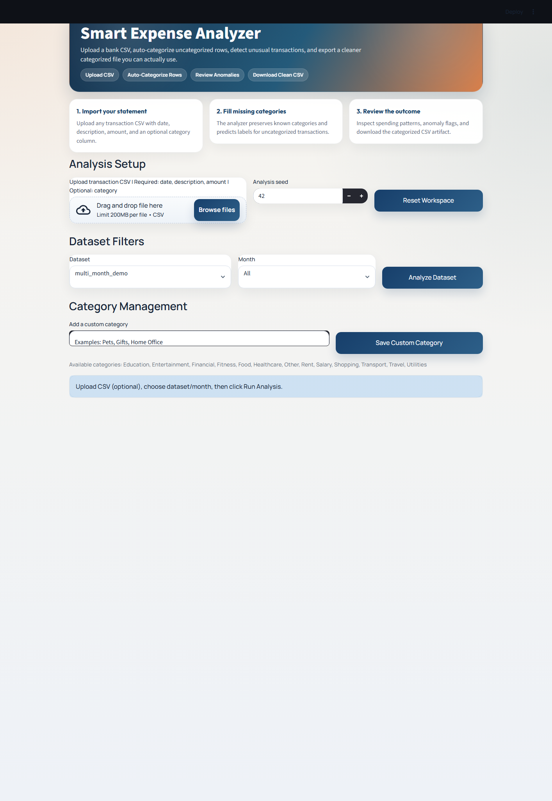
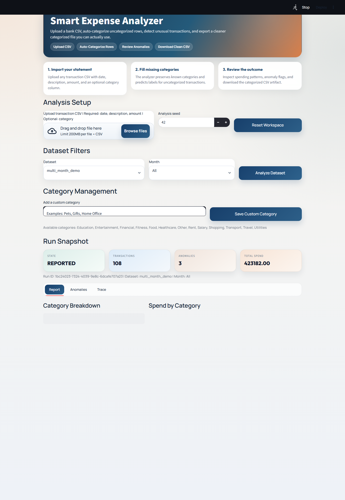

# Smart Expense Analyzer

Smart Expense Analyzer is a Python expense analysis app with a FastAPI backend and a custom web frontend. It helps teams upload bank or card CSVs, categorize transactions, review anomalies, spot recurring spend, and export cleaned outputs from one place.

## What It Does

- Upload CSV files with `date`, `description`, `amount`, and optional `category`
- Auto-categorize uncategorized rows using:
  - CSV-provided categories
  - learned merchant matches from earlier runs
  - similarity matching inside the current dataset
  - a lightweight local ML classifier
  - keyword rules
- Detect statistical anomalies with category-aware scoring
- Surface recurring expenses and likely subscriptions
- Save category corrections and anomaly review feedback
- Export categorized data, summaries, anomaly files, and reports

## Screenshots

### Home



### Results



## Architecture

The project keeps the analysis engine in Python and serves a custom web UI through FastAPI.

Main flow:

1. Upload a CSV
2. Import transactions into the local database
3. Run categorization
4. Run anomaly detection
5. Generate metrics and report artifacts
6. Review results in the frontend

State machine:

`INIT -> DATA_LOADED -> CATEGORIZED -> ANOMALIES_DETECTED -> REPORTED`

More detail: [docs/architecture.md](docs/architecture.md)

## Project Structure

```text
src/
  agent.py
  anomaly_detector.py
  categorizer.py
  database.py
  intelligence.py
  reporting.py
  web_app.py
web/
  index.html
  static/
    app.js
    styles.css
tests/
docs/
data/
```

## Key Files

- [src/web_app.py](src/web_app.py): FastAPI app and API routes
- [web/static/app.js](web/static/app.js): frontend interaction logic
- [web/static/styles.css](web/static/styles.css): UI styling
- [src/categorizer.py](src/categorizer.py): categorization pipeline
- [src/anomaly_detector.py](src/anomaly_detector.py): anomaly detection
- [src/database.py](src/database.py): persistence and merchant memory
- [src/agent.py](src/agent.py): orchestration and artifact generation

## Local Setup

### 1. Create a virtual environment

```powershell
python -m venv .venv
.venv\Scripts\Activate.ps1
```

### 2. Install dependencies

```powershell
python -m pip install -r requirements.txt
```

### 3. Run the web app

```powershell
python -m uvicorn src.web_app:app --reload --host 127.0.0.1 --port 8503
```

Open:

`http://127.0.0.1:8503`

## CLI and Testing

Run the sample CLI workflow:

```powershell
python -m src.main
```

Run all tests:

```powershell
python -m unittest discover -s tests -v
```

Run a single test module:

```powershell
python -m unittest tests.test_categorizer -v
```

Run evaluation scenarios:

```powershell
python -c "from src.evaluation import run_evaluation; print(run_evaluation(seed=42, scenario_count=10))"
```

## Outputs

Each run can write artifacts into `runs/`, including:

- categorized CSV
- merchant summary CSV
- anomalies CSV
- summary JSON
- report text
- JSONL observability log

## Categorization Pipeline

The app now uses a layered categorization pipeline:

- deterministic signals first:
  - CSV input
  - learned merchant matches
  - similarity matching
- local ML next:
  - a lightweight seeded naive Bayes classifier
- keyword rules and fallback last:
  - rules catch common merchants and patterns
  - fallback keeps unclear rows reviewable instead of silently overconfident

## Deployment

Deployment instructions are in [docs/deployment.md](docs/deployment.md).

## Repository

[https://github.com/anarghya-Shivanagere/smart-expense-analyzer](https://github.com/anarghya-Shivanagere/smart-expense-analyzer)
