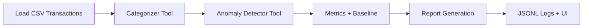

# Architecture and State Machine

```mermaid
flowchart LR
    A[Load CSV Transactions] --> B[Categorizer Tool]
    B --> C[Anomaly Detector Tool]
    C --> D[Metrics + Baseline]
    D --> E[Report Generation]
    E --> F[JSONL Logs + UI]
```

State machine:

`INIT -> DATA_LOADED -> CATEGORIZED -> ANOMALIES_DETECTED -> REPORTED`

Failure path:

`ANY_STATE -> FAILED`
